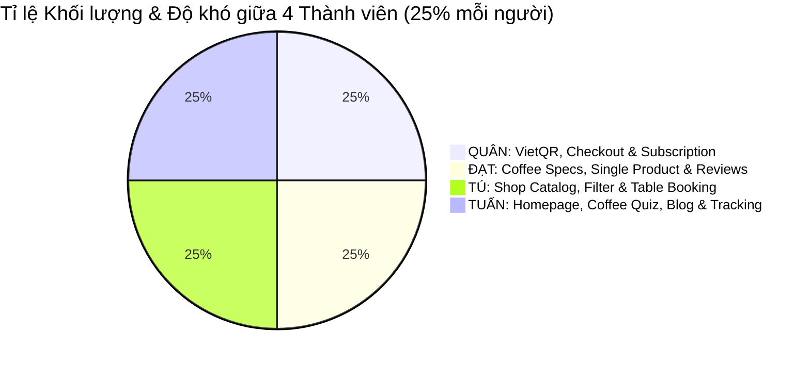

# ☕ BẢN KẾ HOẠCH CHI TIẾT DỰ ÁN WEBSITE BÁN CÀ PHÊ (COFFEE E-COMMERCE & EXPERIENCE)
> **Dự án:** Xây dựng Hệ thống Website Thương mại Điện tử Bán Cà phê & Trải nghiệm F&B  
> **Nhóm thực hiện (4 Thành viên):** **ĐẠT — QUÂN — TÚ — TUẤN** (`Group-A-CMS-FINAL`)  
> **Nền tảng kỹ thuật:** WordPress 6.8+ | WooCommerce 9+ | Docker Localhost (PHP 8.2, MariaDB 10.11, Apache)  
> **Theme nền tảng:** `coffee-cafe-corner`  
> **Phương pháp phát triển:** Khai thác theme kết hợp **Child Theme** (`coffee-cafe-corner-child`) & **Custom Plugin** (`group-a-coffee-core`) — Không phụ thuộc hoàn toàn vào theme.  
> **Nguyên tắc phân công:** **Chia đều 100% về cả Giao diện UI các trang, Phần lập trình Frontend (CSS/JS) và Phần Backend (PHP/Hooks/DB/AJAX). Mỗi thành viên làm chủ trọn vẹn 1 phân hệ Full-stack với độ khó và khối lượng tương đương nhau.**

---

## MỤC LỤC
1. [Tổng quan dự án & Định vị thương hiệu](#1-tổng-quan-dự-án--định-vị-thương-hiệu)
2. [Kiến trúc kỹ thuật & Chiến lược Custom Code](#2-kiến-trúc-kỹ-thuật--chiến-lược-custom-code)
3. [Danh mục toàn bộ các trang cần thực hiện (18 Trang)](#3-danh-mục-toàn-bộ-các-trang-cần-thực-hiện-18-trang)
4. [Các tính năng nâng cao & đặc thù ngành Cà phê](#4-các-tính-năng-nâng-cao--đặc-thù-ngành-cà-phê)
5. [Bảng đối soát cân bằng công việc cho 4 thành viên (Đạt - Quân - Tú - Tuấn)](#5-bảng-đối-soát-cân-bằng-công-việc-cho-4-thành-viên-đạt---quân---tú---tuấn)
6. [Chi tiết nhiệm vụ Full-stack của từng thành viên](#6-chi-tiết-nhiệm-vụ-full-stack-của-từng-thành-viên)
   - [6.1. QUÂN: Mua hàng nhanh, Thanh toán VietQR & Gói Cà phê định kỳ](#61-quân-mua-hàng-nhanh-thanh-toán-vietqr--gói-cà-phê-định-kỳ)
   - [6.2. ĐẠT: Thông số cà phê chuyên sâu, Trang Chi tiết & Đánh giá có ảnh](#62-đạt-thông-số-cà-phê-chuyên-sâu-trang-chi-tiết--đánh-giá-có-ảnh)
   - [6.3. TÚ: Cửa hàng Catalog, Bộ lọc đa tầng & Hệ thống Đặt bàn](#63-tú-cửa-hàng-catalog-bộ-lọc-đa-tầng--hệ-thống-đặt-bàn)
   - [6.4. TUẤN: Trang chủ Branding, Trắc nghiệm tìm gu, Cẩm nang & Tra cứu đơn](#64-tuấn-trang-chủ-branding-trắc-nghiệm-tìm-gu-cẩm-nang--tra-cứu-đơn)
7. [Ma trận phân nhiệm trách nhiệm (RACI Matrix)](#7-ma-trận-phân-nhiệm-trách-nhiệm-raci-matrix)
8. [Lộ trình triển khai theo 5 Sprint](#8-lộ-trình-triển-khai-theo-5-sprint)
9. [Quy chuẩn phối hợp nhóm & Đồng bộ Git/Docker](#9-quy-chuẩn-phối-hợp-nhóm--đồng-bộ-gitdocker)
10. [Kịch bản kiểm thử & Tiêu chuẩn hoàn thành (DoD)](#10-kịch-bản-kiểm-thử--tiêu-chuẩn-hoàn-thành-dod)

---

## 1. TỔNG QUAN DỰ ÁN & ĐỊNH VỊ THƯƠNG HIỆU

### 1.1. Mục tiêu dự án
Xây dựng một website thương mại điện tử chuyên biệt về cà phê hạt rang mộc, cà phê bột nguyên chất, cà phê đặc sản (Specialty Coffee), cà phê tiện lợi (Drip Bag/Cold Brew) và dụng cụ pha chế. Website kết hợp trải nghiệm mua sắm hiện đại chuẩn thị trường Việt Nam (VietQR, Checkout tinh gọn, giao cà phê định kỳ) và văn hóa thưởng thức cà phê thủ công (Câu chuyện nông trại, cẩm nang pha chế, trắc nghiệm tìm gu, đặt bàn trải nghiệm cupping tại quán).

### 1.2. Tone & Mood thiết kế
- **Màu sắc chủ đạo:**
  - Nâu Espresso đậm (`#2C1810`) - Nền tảng thương hiệu cà phê truyền thống.
  - Màu Kem sữa mịn (`#F5EFEB`) - Tạo không gian thanh lịch, sáng sủa, dễ đọc.
  - Vàng đồng hạt dẻ (`#C5A880`) - Nhấn nhá các nút bấm, huy hiệu giải thưởng, CTA.
  - Xanh lá nông trại (`#3D5A40`) - Thể hiện nguồn gốc hạt cà phê sạch bền vững.
- **Phong cách:** Sang trọng, hiện đại, ấm cúng, đậm chất xưởng rang thủ công (Artisan Roastery).

---

## 2. KIẾN TRÚC KỸ THUẬT & CHIẾN LƯỢC CUSTOM CODE

Để **không phụ thuộc hoàn toàn vào theme `coffee-cafe-corner`** và đảm bảo code của 4 thành viên không bị ghi đè khi cập nhật:

```
Group-A-CMS-FINAL/
├── wp-content/
│   ├── themes/
│   │   ├── coffee-cafe-corner/               [Base Theme gốc - Giữ nguyên không sửa]
│   │   └── coffee-cafe-corner-child/         [Child Theme - Nhóm tự code mở rộng]
│   │       ├── style.css                     (Tùy biến typography, palette màu sắc, animation)
│   │       ├── functions.php                 (Nạp CSS/JS riêng, override layout hooks)
│   │       ├── woocommerce/                  (Ghi đè template WooCommerce)
│   │       │   ├── single-product/           (Bố cục trang chi tiết sản phẩm - Đạt)
│   │       │   ├── archive-product.php       (Bố cục lưới sản phẩm cửa hàng - Tú)
│   │       │   └── checkout/form-checkout.php(Giao diện thanh toán 1 cột - Quân)
│   │       └── assets/
│   │           ├── css/custom-ecommerce.css
│   │           └── js/coffee-interactions.js
│   └── plugins/
│       └── group-a-coffee-core/              [Plugin nghiệp vụ riêng do nhóm tự viết]
│           ├── group-a-coffee-core.php       (Entry file nạp 4 module)
│           ├── includes/
│           │   ├── class-vietqr-checkout.php (Module QUÂN: Cổng VietQR, Checkout & Subscription)
│           │   ├── class-coffee-meta.php     (Module ĐẠT: Custom Fields, Biến thể & Photo Review)
│           │   ├── class-shop-filter.php     (Module TÚ: AJAX Filter, Đặt bàn Booking & Wishlist)
│           │   └── class-quiz-tracking.php   (Module TUẤN: Coffee Quiz, Tra cứu đơn & SEO)
│           └── templates/
```

---

## 3. DANH MỤC TOÀN BỘ CÁC TRANG CẦN THỰC HIỆN (18 TRANG)

| STT | Tên trang | Đường dẫn (URL) | Mục đích & Nội dung cốt lõi | Người phụ trách chính |
| :---: | :--- | :--- | :--- | :---: |
| **1** | **Trang Chủ (Homepage)** | `/` | Hero Banner, Triết lý rang xay, Best Sellers Carousel, Khối nông trại, Testimonials, Header & Footer. | **TUẤN** |
| **2** | **Cửa Hàng (Shop Tổng)** | `/cua-hang/` | Danh sách toàn bộ sản phẩm; Sidebar bộ lọc đa tầng; Thẻ sản phẩm có badge Hot/Sale; Phân trang AJAX. | **TÚ** |
| **3** | **Danh Mục Cà Phê Hạt Mộc** | `/danh-muc/ca-phe-nguyen-chat/` | Lọc các dòng: Arabica Cầu Đất, Robusta Buôn Ma Thuột, Fine Robusta, Blend đặc biệt. | **TÚ** |
| **4** | **Danh Mục Cà Phê Tiện Lợi** | `/danh-muc/ca-phe-tien-loi/` | Drip Bag (Túi lọc tiện lợi), Cà phê hòa tan sấy lạnh, Cold Brew đóng chai sẵn. | **TÚ** |
| **5** | **Danh Mục Dụng Cụ Pha Chế** | `/danh-muc/dung-cu-pha-che/` | Phin nhôm cao cấp, Ấm đun cổ ngỗng, Phễu V60, Bình French Press, Cối xay tay. | **TÚ** |
| **6** | **Chi Tiết Sản Phẩm Cà Phê** | `/san-pham/{slug}/` | Gallery ảnh zoom, Giá, Chọn khối lượng (250g/500g/1kg), Chọn dạng xay, Bảng thông số hạt, Thang đo độ rang, Tasting Notes. | **ĐẠT** |
| **7** | **Đánh Giá & Phản Hồi Có Ảnh** | Nằm trong `/san-pham/{slug}/` | Form nhận xét sao, upload hình ảnh thực tế của người mua, danh sách review có hình ảnh. | **ĐẠT** |
| **8** | **Mua Kèm Combo (Upsell)** | Nằm trong `/san-pham/{slug}/` | Khối "Thường được mua cùng": Mua gói cà phê kèm phin nhôm giảm 15% tổng hóa đơn. | **ĐẠT** |
| **9** | **Trắc Nghiệm Chọn Gu Cà Phê** | `/chon-gu-ca-phe/` | Quiz 4 câu hỏi tương tác trượt slide (Dụng cụ pha, khẩu vị, gu sữa) $\rightarrow$ Đề xuất ngay gói cà phê chân ái. | **TUẤN** |
| **10** | **Cà Phê Định Kỳ (Subscription)** | `/ca-phe-dinh-ky/` | Giao diện đăng ký nhận hạt cà phê rang mới định kỳ mỗi 2 tuần hoặc mỗi tháng tự động. | **QUÂN** |
| **11** | **Mini-Cart Drawer & Giỏ Hàng** | `/gio-hang/` & Drawer | Ngăn kéo giỏ trượt realtime, thanh đo Freeship, trang giỏ hàng chi tiết có đổi số lượng và coupon. | **QUÂN** |
| **12** | **Thanh Toán (Checkout)** | `/thanh-toan/` | Form giao hàng 1 cột tinh gọn, kiểm tra SĐT VN, chọn COD / VietQR, tính phí vận chuyển thông minh. | **QUÂN** |
| **13** | **Xác Nhận Đơn Hàng (Thank You)** | `/thanh-toan/order-received/` | Lời cảm ơn, mã đơn hàng, hiển thị mã VietQR động to rõ, nút tải mã QR và nút copy số tài khoản. | **QUÂN** |
| **14** | **Tra Cứu Đơn Hàng Nhanh** | `/tra-cuu-don-hang/` | Nhập Mã đơn hàng + Số điện thoại để theo dõi Timeline 4 bước vận chuyển mà không cần đăng nhập. | **TUẤN** |
| **15** | **Đặt Bàn / Workshop Cupping** | `/dat-ban/` | Form đặt lịch trải nghiệm thử nếm cà phê tại quán; Datepicker chọn ngày, giờ, số người và gói trải nghiệm. | **TÚ** |
| **16** | **Về Chúng Tôi (Storytelling)** | `/ve-chung-toi/` | Hành trình từ nông trại Cầu Đất đến xưởng rang, câu chuyện cùng nông dân, quy trình chọn hạt chín 100%. | **TUẤN** |
| **17** | **Cẩm Nang Cà Phê (Blog)** | `/kien-thuc/` & Bài viết | Chuyên mục chia sẻ mẹo pha phin chuẩn vị, cách ủ Cold Brew, phân biệt Arabica và Robusta; chuẩn SEO. | **TUẤN** |
| **18** | **Liên Hệ & Bản Đồ Chi Nhánh** | `/lien-he/` & Chính sách | Địa chỉ xưởng rang & các quán chi nhánh, Google Maps, form liên hệ; Các trang chính sách đổi trả / giao hàng. | **TUẤN** |

---

## 4. CÁC TÍNH NĂNG NÂNG CAO & ĐẶC THÙ NGÀNH CÀ PHÊ

Để website nổi bật và đạt điểm tối đa trong bài đánh giá, nhóm tích hợp thêm các tính năng thương mại điện tử F&B hiện đại:
1. **Giao cà phê định kỳ (Coffee Subscription):** Khách hàng đăng ký gói hạt cà phê rang mới giao tận nhà theo chu kỳ (2 tuần / 1 tháng), được giảm 10% giá trị gói.
2. **Thanh đo Freeship động (Free Shipping Progress Bar):** Thanh trượt realtime trong giỏ hàng: *"Bạn chỉ cần mua thêm 45.000đ để được Miễn phí giao hàng toàn quốc!"*.
3. **Cổng thanh toán VietQR động chuẩn Napas 247:** Tự động tạo mã QR có sẵn số tiền và nội dung đơn hàng, khách quét app ngân hàng là trả tiền ngay không sợ nhầm lẫn.
4. **Đánh giá kèm ảnh thực tế (Photo Reviews):** Khách hàng sau khi nhận hàng có thể chụp ảnh gói cà phê hoặc ly nước thành phẩm tải lên kèm số sao đánh giá.
5. **Bộ lọc sản phẩm không tải lại trang (AJAX Faceted Filter):** Sàng lọc nhanh theo mức giá, mức độ rang (Light/Medium/Dark) và phương pháp pha.
6. **Coffee Finder Quiz (Trắc nghiệm khẩu vị):** Giúp người mới bắt đầu dễ dàng chọn được đúng loại hạt yêu thích chỉ qua 4 câu hỏi trực quan.
7. **Tra cứu đơn hàng không cần đăng nhập:** Kiểm tra trạng thái đơn hàng nhanh chóng chỉ bằng SĐT người nhận.
8. **Thông báo đơn hàng vừa mua (Recent Sales Notification Toast):** Popup nhỏ góc dưới màn hình hiển thị đơn hàng mới để tăng tính uy tín và kích thích mua sắm.

---

## 5. BẢNG ĐỐI SOÁT CÂN BẰNG CÔNG VIỆC CHO 4 THÀNH VIÊN (ĐẠT - QUÂN - TÚ - TUẤN)



| Tiêu chí đối soát | QUÂN | ĐẠT | TÚ | TUẤN |
| :--- | :---: | :---: | :---: | :---: |
| **Phân hệ sở hữu** | **Mua Hàng Nhanh, VietQR & Subscription** | **Thông Số Cà Phê, Chi Tiết & Đánh Giá** | **Cửa Hàng, Lọc Đa Tầng & Đặt Bàn** | **Trang Chủ, Trắc Nghiệm Gu, Blog & Tra Cứu** |
| **Giao diện UI các trang dựng chính** | 1. Trang Giỏ hàng (`/gio-hang/`)<br>2. Trang Checkout (`/thanh-toan/`)<br>3. Trang Thank You (`/order-received/`)<br>4. Trang Cà phê định kỳ (`/ca-phe-dinh-ky/`)<br>5. Drawer Mini-Cart trượt | 1. Trang Chi tiết SP (`/san-pham/{slug}/`)<br>2. Gallery ảnh & Zoom ảnh<br>3. Thẻ Thông số hạt cà phê<br>4. Thanh đo độ rang (Roast Meter)<br>5. Khối Đánh giá có ảnh thực tế<br>6. Khối Mua kèm combo (Upsell) | 1. Trang Cửa hàng tổng (`/cua-hang/`)<br>2. Danh mục Cà phê hạt mộc<br>3. Danh mục Cà phê tiện lợi<br>4. Danh mục Dụng cụ pha chế<br>5. Sidebar Bộ lọc Faceted<br>6. Trang Đặt bàn (`/dat-ban/`) | 1. Trang Chủ (Homepage `/`)<br>2. Header & Footer toàn trang<br>3. Trang Trắc nghiệm (`/chon-gu-ca-phe/`)<br>4. Trang Tra cứu đơn (`/tra-cuu-don-hang/`)<br>5. Trang Về chúng tôi (`/ve-chung-toi/`)<br>6. Trang Cẩm nang Blog & Liên hệ |
| **Trọng trách Backend (PHP/DB/Hook/API)** | • Cổng VietQR Napas 247 QuickLink.<br>• Hook tinh gọn form checkout & validate SĐT 10 số.<br>• Logic lưu chu kỳ gói Subscription.<br>• Tính phí ship nội/ngoại thành & Freeship. | • Custom Meta Box: Vùng trồng, Giống, Sơ chế, Độ cao, Độ rang, Hương vị.<br>• Logic Biến thể kép (Trọng lượng & Dạng xay).<br>• Backend upload & duyệt ảnh review khách hàng trong Admin. | • Lập trình AJAX Faceted Filter theo Giá, Độ rang, Gu vị qua `WP_Query`.<br>• CPT Đặt bàn (`coffee_booking`), lưu database & gửi Email tự động.<br>• Module Wishlist lưu cookie/DB. | • Thuật toán Coffee Quiz tính điểm gợi ý sản phẩm phù hợp.<br>• API Tra cứu đơn hàng theo SĐT + Mã đơn.<br>• Cấu hình SEO Schema Markup `Product`, `Organization`. |
| **Trọng trách Frontend (HTML/CSS/JS)** | • Drawer Mini-cart trượt mượt mà.<br>• Thanh đo Freeship sinh động.<br>• Nút 1-click copy STK và tải mã QR. | • Thanh đo mức độ rang (Roast Meter) CSS 5 nấc trực quan.<br>• Huy hiệu Tasting Notes bo tròn.<br>• JS chọn biến thể nhảy giá realtime. | • Lưới Shop Grid và thẻ card có nhãn Hot/Sale.<br>• Slider chọn giá tiền Sidebar.<br>• Form Đặt bàn UI có Datepicker. | • Hero Banner tương tác và khối Story xưởng rang.<br>• Giao diện trắc nghiệm Quiz trượt từng bước (Multi-step JS).<br>• Timeline 4 bước tra cứu đơn hàng.<br>• Popup Toast đơn hàng vừa mua. |
| **Điểm độ khó kỹ thuật** | **8.5 / 10** | **8.5 / 10** | **8.5 / 10** | **8.5 / 10** |
| **Tỉ lệ khối lượng (%)** | **25%** | **25%** | **25%** | **25%** |
| **Tệp mã nguồn chính** | `class-vietqr-checkout.php`<br>`form-checkout.php` | `class-coffee-meta.php`<br>`single-product/` | `class-shop-filter.php`<br>`archive-product.php` | `class-quiz-tracking.php`<br>`front-page.html` |

---

## 6. CHI TIẾT NHIỆM VỤ FULL-STACK CỦA TỪNG THÀNH VIÊN

---

### 6.1. QUÂN: MUA HÀNG NHANH, THANH TOÁN VIETQR & GÓI CÀ PHÊ ĐỊNH KỲ
> **Mục tiêu phân hệ:** Tạo trải nghiệm mua sắm và thanh toán nhanh chóng nhất, tối ưu chuyển đổi bằng giỏ hàng trượt, cổng thanh toán tự động VietQR và mô hình kinh doanh cà phê định kỳ (Subscription).

* **Giao diện UI các trang dựng chính:**
  1. **Trang Giỏ hàng (`/gio-hang/`):** Bảng danh sách sản phẩm đã chọn, nút tăng giảm số lượng mượt mà, khối nhập mã giảm giá, thanh hiển thị tiến trình miễn phí giao hàng (*Freeship Progress Bar*), khối sản phẩm gợi ý thêm phin nhôm hoặc thìa đong hạt.
  2. **Trang Thanh toán Checkout (`/thanh-toan/`):** Giao diện 1 cột tinh gọn, phân khu rõ ràng giữa thông tin giao hàng và khu vực chọn phương thức thanh toán (COD / Chuyển khoản VietQR).
  3. **Trang Xác nhận đơn hàng (`/order-received/`):** Giao diện hóa đơn đẹp mắt, hiển thị mã VietQR động kích thước lớn, nút tải mã QR về máy, nút sao chép nhanh số tài khoản và nội dung chuyển khoản.
  4. **Trang Gói Cà Phê Định Kỳ (`/ca-phe-dinh-ky/`):** Giao diện giới thiệu dịch vụ giao cà phê rang mới định kỳ, bảng chọn chu kỳ giao (mỗi 2 tuần hoặc mỗi tháng) kèm ưu đãi chiết khấu 10%.
  5. **Giao diện Drawer Mini-Cart:** Ngăn kéo giỏ hàng trượt từ cạnh phải màn hình khi khách bấm "Thêm vào giỏ", hiển thị ảnh nhỏ, giá tiền, số lượng và nút thanh toán ngay.

* **Phần việc Backend (PHP & WordPress Hooks):**
  1. **Lập trình Cổng thanh toán VietQR động (`class-vietqr-checkout.php`):**
     - Kế thừa lớp `WC_Payment_Gateway` của WooCommerce.
     - Tích hợp API chuẩn QuickLink Napas 247: tự động sinh URL mã QR gắn ID đơn hàng, số tài khoản nhận và số tiền chính xác từng đồng.
     - Lưu thông tin chuyển khoản vào đơn hàng và đính kèm hướng dẫn quét mã QR trong email gửi khách.
  2. **Tinh gọn form Checkout (`woocommerce_checkout_fields`):**
     - Lược bỏ các trường rườm rà không dùng ở VN (Mã bưu điện, Tên công ty, Địa chỉ dòng 2).
     - Viết hàm kiểm tra tính hợp lệ của số điện thoại Việt Nam (10 chữ số, đúng đầu số nhà mạng).
  3. **Xử lý gói Cà phê định kỳ (Subscription Logic):**
     - Xử lý lưu thông tin chu kỳ nhận hàng vào dữ liệu đơn hàng và kích hoạt trạng thái khách hàng thân thiết.
  4. **Cấu hình phí vận chuyển:**
     - Đồng giá nội thành / ngoại thành và tự động kích hoạt Freeship khi giỏ hàng đạt từ 300.000đ trở lên.
  5. **Quản trị hệ thống chung:** Khởi tạo cấu trúc Child Theme, Plugin Core, phân nhánh Git và hỗ trợ chạy script đồng bộ `export-db.bat`.

* **Phần việc Frontend JS & Hiệu ứng:**
  - Viết script AJAX thêm sản phẩm vào giỏ không load lại trang, kích hoạt hiệu ứng mở ngăn kéo Mini-cart.
  - Tích hợp Clipboard API: 1-click sao chép số tài khoản và cú pháp chuyển khoản có thông báo toast nhỏ *"Đã sao chép thành công!"*.

---

### 6.2. ĐẠT: THÔNG SỐ CÀ PHÊ CHUYÊN SÂU, TRANG CHI TIẾT & ĐÁNH GIÁ CÓ ẢNH
> **Mục tiêu phân hệ:** Thể hiện đẳng cấp của xưởng rang cà phê qua trang chi tiết sản phẩm chuẩn quốc tế, minh bạch nguồn gốc nông trại và kích thích lòng tin qua đánh giá thực tế của khách mua.

* **Giao diện UI các trang dựng chính:**
  1. **Trang Chi tiết sản phẩm Cà phê (`/san-pham/{slug}/`):** Bố cục 2 cột sang trọng phong cách Artisan Roastery.
  2. **Gallery ảnh sản phẩm & Zoom ảnh:** Slider ảnh gói cà phê, ảnh hạt mộc, ảnh tách cà phê thành phẩm sắc nét có hiệu ứng phóng to chi tiết khi rê chuột.
  3. **Bảng Thông số Hạt cà phê (Coffee Specs Card):** Bảng thông tin dạng lưới trực quan thể hiện: Vùng trồng (Cầu Đất / Đắk Lắk), Độ cao (1.500m - 1.650m), Giống hạt (Bourbon / Typica / Robusta Sẻ), Phương pháp sơ chế (Washed / Natural / Honey).
  4. **Thanh đo mức độ rang (Roast Level Meter):** Thiết kế thanh đo 5 nấc visual bằng CSS/JS động từ màu nâu sáng (Light) $\rightarrow$ nâu hạt dẻ (Medium) $\rightarrow$ nâu đen bóng (Dark) kèm con trỏ chỉ vị trí rang của gói cà phê.
  5. **Huy hiệu Hương vị (Tasting Notes Badges):** Các thẻ tag bo tròn bắt mắt với icon minh họa (Hương hoa nhài, Vị socola đen, Hạt phỉ, Hậu vị ngọt sâu).
  6. **Khối Đánh giá & Phản hồi kèm ảnh (Customer Photo Reviews):** Bảng nhận xét khách hàng, form đánh giá sao kèm ô tải ảnh chụp thực tế ly cà phê tại nhà.
  7. **Khối Mua kèm Combo (Frequently Bought Together):** Hộp gợi ý mua gói cà phê cùng phin nhôm hoặc phễu lọc V60 được giảm thêm 15% tổng giá trị.

* **Phần việc Backend (PHP & Data Structure):**
  1. **Lập trình Custom Meta Box Cà phê (`class-coffee-meta.php`):**
     - Tạo bảng nhập liệu trong trang quản trị WP-Admin cho sản phẩm cà phê: Vùng trồng, Độ cao, Giống hạt, Phương pháp sơ chế, Điểm độ rang (1-5), Ghi chú hương vị.
     - Viết hook `save_post_product` lưu và bảo mật dữ liệu meta.
  2. **Cấu hình Logic Biến thể kép (Variable Products):**
     - Thuộc tính **Trọng lượng:** `250g` (giá gốc), `500g` (tiết kiệm 5%), `1kg` (tiết kiệm 10%).
     - Thuộc tính **Dạng xay tùy gu:** `Nguyên hạt (Whole Bean)`, `Xay vừa (Pha Phin truyền thống, V60)`, `Xay mịn (Máy Espresso, Moka pot)`, `Xay thô (Ủ Cold Brew, French Press)`.
     - Xử lý quản lý tồn kho và mã SKU theo từng biến thể.
  3. **Xử lý upload ảnh đánh giá:**
     - Cho phép khách đính kèm tối đa 3 ảnh khi viết đánh giá, tự động nén kích thước ảnh và lưu vào thư viện media của WordPress.

* **Phần việc Frontend JS & Hiệu ứng:**
  - Viết JavaScript bắt sự kiện đổi biến thể (chọn khối lượng hoặc dạng xay) tự động cập nhật giá tiền, mã SKU và tình trạng còn hàng/hết hàng tức thì mà không giật màn hình.
  - Hiệu ứng Lightbox phóng to ảnh sản phẩm và ảnh chụp của khách hàng khi bấm xem.

---

### 6.3. TÚ: CỬA HÀNG CATALOG, BỘ LỌC ĐA TẦNG & HỆ THỐNG ĐẶT BÀN
> **Mục tiêu phân hệ:** Giúp khách hàng dễ dàng khám phá, sàng lọc bộ sưu tập cà phê theo đúng khẩu vị và sở thích pha chế cá nhân, đồng thời kết nối khách hàng đến trải nghiệm trực tiếp tại quán qua tính năng Đặt bàn.

* **Giao diện UI các trang dựng chính:**
  1. **Trang Cửa hàng Tổng (`/cua-hang/`):** Lưới sản phẩm dạng Grid (3 cột Desktop, 2 cột Mobile) cân đối, khoảng cách chuẩn typography, phân trang AJAX mượt mà.
  2. **Các trang Danh mục con:**
     - Cà phê hạt rang mộc (`/danh-muc/ca-phe-nguyen-chat/`)
     - Cà phê tiện lợi & Drip bag (`/danh-muc/ca-phe-tien-loi/`)
     - Dụng cụ & Máy pha chế (`/danh-muc/dung-cu-pha-che/`)
  3. **Giao diện Thanh bên Bộ lọc Đa tầng (Sidebar Faceted Filter):**
     - Thanh trượt kéo chọn khoảng giá (Price Range Slider).
     - Hộp chọn mức độ rang (Light, Medium, Dark có icon hạt cà phê).
     - Hộp chọn phương pháp pha (Phin, Máy Espresso, Cold Brew).
     - Nút "Xóa bộ lọc" để hoàn tác kết quả về mặc định.
  4. **Thẻ sản phẩm nâng cao (Advanced Product Card):**
     - Ảnh đại diện có hiệu ứng hover đổi sang ảnh thứ 2 (chụp mặt sau hoặc hạt cà phê).
     - Các nhãn huy hiệu nổi bật (*Bán chạy*, *Mới về*, *Freeship*).
     - Nút *Quick View (Xem nhanh)* dạng popup và nút *Thêm vào danh sách yêu thích (Wishlist)*.
  5. **Trang Đặt bàn / Workshop Thử nếm Cupping (`/dat-ban/`):**
     - Giao diện form đặt lịch trang nhã, ấm cúng.
     - Lịch Datepicker chọn ngày, khung giờ (Sáng / Chiều / Tối) và số lượng khách.
     - Khối thông tin giới thiệu 2 gói trải nghiệm: *Thưởng thức cà phê & Trò chuyện*, *Workshop tự tay pha V60 / Espresso cùng Barista*.

* **Phần việc Backend (PHP & Database Queries):**
  1. **Lập trình Bộ lọc sản phẩm không tải lại trang (AJAX Faceted Filter - `class-shop-filter.php`):**
     - Xây dựng AJAX Endpoint nhận tham số lọc: khoảng giá, mức độ rang, dụng cụ pha chế, vùng trồng.
     - Viết câu truy vấn `WP_Query` kết hợp `tax_query` và `meta_query` tối ưu hiệu năng và trả về kết quả dạng JSON.
  2. **Lập trình Hệ thống Đặt bàn & Workshop (`class-table-booking.php`):**
     - Tạo Custom Post Type `coffee_booking` quản lý thông tin đặt chỗ: Họ tên, Số điện thoại, Email, Chi nhánh, Ngày giờ, Số lượng khách, Yêu cầu đặc biệt.
     - Tự động gửi email xác nhận kèm mã đặt bàn cho khách và thông báo email cho quản lý quán.
     - Viết Shortcode `[coffee_table_booking]` để nhúng form vào trang.
  3. **Lập trình Module Wishlist (Sản phẩm yêu thích):**
     - Lưu danh sách sản phẩm yêu thích vào Cookie/Database, hiển thị số lượng yêu thích trên header.

* **Phần việc Frontend JS & Hiệu ứng:**
  - Viết script xử lý AJAX lọc sản phẩm, hiển thị hiệu ứng skeleton loading mượt mà trong lúc chờ dữ liệu.
  - Xử lý mở Modal xem nhanh sản phẩm (Quick View) mà không cần rời trang cửa hàng.

---

### 6.4. TUẤN: TRANG CHỦ BRANDING, TRẮC NGHIỆM TÌM GU, CẨM NANG & TRA CỨU ĐƠN
> **Mục tiêu phân hệ:** Tạo điểm chạm thương hiệu ấn tượng đầu tiên cho khách hàng qua Trang chủ, giải quyết bài toán tư vấn chọn cà phê qua Coffee Quiz, giữ chân người dùng bằng cẩm nang pha chế và cung cấp công cụ hậu mãi tra cứu đơn hàng minh bạch.

* **Giao diện UI các trang dựng chính:**
  1. **Trang Chủ (Homepage - `/`):**
     - Hero Banner ấn tượng với câu slogan truyền cảm hứng, nút kêu gọi hành động (CTA) "Khám phá ngay".
     - Khối "Triết lý rang mộc & Vùng nguyên liệu sạch" với thiết kế so le ảnh - chữ hiện đại.
     - Khối Carousel "Sản phẩm được yêu thích nhất (Best Sellers)" và khối Flash Sale combo hạt cà phê.
     - Khối đánh giá của các Barista chuyên nghiệp và khách hàng thân thiết.
     - Thiết kế hệ thống điều hướng Header (Logo, Menu phân cấp, Thanh tìm kiếm nhanh, Biểu tượng Wishlist, Giỏ hàng) & Footer đầy đủ thông tin chi nhánh, chính sách, mạng xã hội.
  2. **Trang Trắc nghiệm tìm gu cà phê (Coffee Finder Quiz - `/chon-gu-ca-phe/`):**
     - Form trắc nghiệm 4 bước chuyển động trượt slide mượt mà bằng JavaScript.
     - Màn hình kết quả chúc mừng và hiển thị gói cà phê được đề xuất chuẩn xác nhất kèm nút "Mua ngay sản phẩm này".
  3. **Trang Tra cứu đơn hàng nhanh (`/tra-cuu-don-hang/`):**
     - Form nhập tinh gọn (chỉ gồm Mã đơn hàng và Số điện thoại nhận hàng).
     - Giao diện Timeline 4 bước trực quan: *1. Đã nhận đơn $\rightarrow$ 2. Đang rang & đóng gói $\rightarrow$ 3. Đang giao hàng $\rightarrow$ 4. Giao thành công*.
  4. **Trang Cẩm nang Cà phê (Blog - `/kien-thuc/`) & Chi tiết bài viết:**
     - Layout bài viết chuẩn tạp chí phong cách sống, mục lục tự động (TOC), nút chia sẻ mạng xã hội Facebook/Zalo, khối sản phẩm liên quan xuất hiện trong bài.
  5. **Trang Về chúng tôi (`/ve-chung-toi/`):** Kể câu chuyện hành trình hạt cà phê từ nông trại Cầu Đất đến xưởng rang.
  6. **Trang Liên hệ & Bản đồ chi nhánh (`/lien-he/`):** Nhúng Google Maps xưởng rang và quán cà phê, thông tin hotline, giờ mở cửa và form gửi phản hồi.
  7. **Các trang Chính sách:** Chính sách đổi trả 7 ngày, Chính sách giao hàng, Chính sách bảo mật thông tin.

* **Phần việc Backend & Logic Thuật toán:**
  1. **Lập trình Thuật toán Coffee Finder Quiz (`class-quiz-tracking.php` - Phần Quiz):**
     - Xây dựng ma trận chấm điểm 4 câu hỏi trắc nghiệm:
       - *Câu 1:* Bạn thường pha cà phê bằng cách nào? (Phin truyền thống / Máy Espresso / Bình V60 Pour-over / Ủ Cold Brew).
       - *Câu 2:* Bạn thích phong vị gì nhất? (Đắng đậm béo ngậy / Chua thanh tinh tế / Hương thơm hoa quả tự nhiên).
       - *Câu 3:* Bạn có thói quen uống kèm sữa không? (Uống cùng sữa đặc / Uống cùng sữa tươi / Chỉ uống cà phê đen mộc).
       - *Câu 4:* Bạn thích mức độ caffeine thế nào? (Mạnh mẽ tỉnh táo ngay / Vừa phải, êm dịu kéo dài).
     - Thuật toán phân tích câu trả lời để tìm ra sản phẩm phù hợp nhất trong cơ sở dữ liệu và trả về kết quả qua AJAX.
  2. **Lập trình Module Tra cứu đơn hàng nhanh (`class-quiz-tracking.php` - Phần Tracking):**
     - Viết hàm AJAX nhận `order_id` và `billing_phone`.
     - Xác thực và truy vấn dữ liệu đơn hàng bằng `wc_get_orders`.
     - Trả về dữ liệu trạng thái đơn hàng bảo mật (không để lộ thông tin thẻ hay địa chỉ chi tiết của người khác).
  3. **Cấu hình SEO On-page:**
     - Thiết lập Schema Markup `Product`, `Organization`, thẻ OpenGraph thumbnail khi chia sẻ link lên Facebook/Zalo.

* **Phần việc Frontend JS & Hiệu ứng:**
  - Hiệu ứng slide trắc nghiệm Quiz bằng JavaScript không cần tải lại trang.
  - Widget thông báo đơn hàng vừa mua (Recent Sales Notification Toast) góc dưới màn hình: *"Một khách hàng tại Hà Nội vừa đặt 500g Arabica Cầu Đất cách đây 3 phút"*.

---

## 7. MA TRẬN PHÂN NHIỆM TRÁCH NHIỆM (RACI MATRIX)

> **R (Responsible):** Người trực tiếp thực hiện  
> **A (Accountable):** Người chịu trách nhiệm phê duyệt và kiểm tra  
> **C (Consulted):** Người được tham vấn ý kiến kỹ thuật  
> **I (Informed):** Người được thông báo kết quả  

| Hạng mục / Tính năng | QUÂN | ĐẠT | TÚ | TUẤN |
| :--- | :---: | :---: | :---: | :---: |
| **Khởi tạo Child Theme & Plugin Core** | **A / R** | C | C | I |
| **Cổng thanh toán VietQR động (Napas 247)** | **A / R** | C | I | I |
| **Form Checkout 1 cột & Tinh gọn trường** | **A / R** | I | C | I |
| **AJAX Mini-cart Drawer & Thanh Freeship** | **A / R** | I | C | I |
| **Giao diện & Logic Gói Cà Phê Định Kỳ** | **A / R** | C | I | I |
| **Custom Meta Box Thông số hạt Cà phê** | C | **A / R** | C | I |
| **Cấu hình Biến thể Trọng lượng & Dạng xay** | I | **A / R** | C | I |
| **Layout Chi tiết sản phẩm & Zoom ảnh** | C | **A / R** | C | I |
| **Thanh đo mức độ rang (Roast Meter CSS/JS)** | I | **A / R** | C | I |
| **Khối Đánh giá có ảnh thực tế (Photo Reviews)** | I | **A / R** | I | C |
| **Khối Mua kèm combo (Frequently Bought Together)**| C | **A / R** | C | I |
| **AJAX Faceted Filter trang Cửa hàng** | C | C | **A / R** | I |
| **Layout Trang Cửa hàng (Shop Grid) & Thẻ SP** | I | C | **A / R** | I |
| **Module Đặt bàn / Workshop Cupping (CPT & Email)** | C | I | **A / R** | I |
| **Giao diện & Form Đặt bàn (`/dat-ban/`)** | I | I | **A / R** | C |
| **Module Wishlist (Sản phẩm yêu thích)** | I | I | **A / R** | C |
| **Thuật toán Coffee Quiz & Gợi ý gu cà phê** | I | C | I | **A / R** |
| **Module Tra cứu đơn hàng AJAX theo SĐT** | C | I | I | **A / R** |
| **Thiết kế Trang Chủ (Homepage), Header & Footer** | C | I | C | **A / R** |
| **Trang Về Chúng Tôi, Blog Pha Chế & Liên hệ** | I | I | I | **A / R** |
| **Popup Toast thông báo đơn hàng vừa mua** | I | I | I | **A / R** |
| **Kiểm thử chéo hệ thống (Cross Testing)** | **R** | **R** | **R** | **A / R** |
| **Đồng bộ Database & Đóng gói (`export-db.bat`)** | **A / R** | C | C | C |

---

## 8. LỘ TRÌNH TRIỂN KHAI THEO 5 SPRINT

### 🏁 Sprint 1: Thiết lập Kiến trúc & Cấu trúc Dữ liệu (Ngày 1 - Ngày 3)
* **QUÂN:** Tạo Child Theme `coffee-cafe-corner-child`, tạo khung plugin `group-a-coffee-core`, phân nhánh Git cho 4 thành viên.
* **ĐẠT:** Cài đặt WooCommerce, cấu hình tiền tệ VNĐ, tạo cây danh mục sản phẩm (Hạt mộc, Drip bag, Dụng cụ).
* **TÚ:** Nạp thư viện Font chữ tiếng Việt, thiết lập bảng màu chủ đạo (Espresso Brown, Warm Cream) vào `style.css` của child theme.
* **TUẤN:** Chuẩn bị bộ tư liệu ảnh chất lượng cao (nông trại, gói cà phê, hạt rang) và soạn thảo khung nội dung các trang tĩnh.
* **Kết quả Sprint 1:** Khung sườn dự án hoạt động đồng bộ trên localhost của cả 4 thành viên.

---

### 🔨 Sprint 2: Lập trình Khung Giao diện & Dữ liệu Cốt lõi (Ngày 4 - Ngày 7)
* **QUÂN:** Xây dựng khung HTML/CSS của Mini-cart drawer và gắn hook vào header.
* **ĐẠT:** Code Custom Meta Box lưu thông số cà phê (Vùng trồng, Sơ chế, Độ rang) và nhập 5 sản phẩm đầu tiên để cả nhóm có dữ liệu test.
* **TÚ:** Dựng layout trang Cửa hàng (Shop Grid), thiết kế thẻ sản phẩm có hiệu ứng hover và nhãn khuyến mãi.
* **TUẤN:** Dựng khung Trang Chủ (Hero Banner, khối giới thiệu xưởng rang) và cấu trúc trang Về chúng tôi.
* **Kết quả Sprint 2:** Xem được Trang Chủ và danh sách sản phẩm trên giao diện web.

---

### ⚙️ Sprint 3: Lập trình Tính năng Nâng cao (Ngày 8 - Ngày 11)
* **QUÂN:** Hoàn thiện Cổng thanh toán VietQR động, form Checkout 1 cột tinh gọn và trang Cà phê định kỳ.
* **ĐẠT:** Override template `single-product/`, hoàn thiện thanh đo độ rang (Roast Meter), bộ chọn dạng xay/trọng lượng và khối đánh giá có ảnh.
* **TÚ:** Lập trình xong bộ lọc AJAX Filter (lọc theo giá, độ rang), code CPT Đặt bàn (`[coffee_table_booking]`) và module Wishlist.
* **TUẤN:** Lập trình xong logic Coffee Quiz (4 câu hỏi gợi ý sản phẩm), module Tra cứu đơn hàng theo SĐT và popup toast mua hàng.
* **Kết quả Sprint 3:** Toàn bộ các tính năng nâng cao đều chạy được mượt mà trên môi trường dev.

---

### 🎨 Sprint 4: Ghép nối, Tối ưu Trải nghiệm & Hoàn thiện Nội dung (Ngày 12 - Ngày 14)
* **QUÂN:** Tối ưu hiệu năng giỏ hàng AJAX, kiểm tra luồng thanh toán trên điện thoại.
* **ĐẠT:** Nhập nốt 10 sản phẩm còn lại với đầy đủ biến thể và thông số chi tiết; kiểm tra khối mua kèm combo.
* **TÚ:** Tối ưu hóa giao diện Responsive trên Mobile/Tablet cho trang Shop và trang Đặt bàn; Xử lý gửi email xác nhận đặt chỗ.
* **TUẤN:** Hoàn thiện 4 bài blog cẩm nang pha chế chuẩn SEO, trang Liên hệ có Google Maps, trang Chính sách.
* **Kết quả Sprint 4:** Toàn bộ 18 trang đều có nội dung thực tế, giao diện chỉn chu, không có trang rác.

---

### 🚀 Sprint 5: Kiểm thử Toàn diện, Đồng bộ & Đóng gói Nghiệm thu (Ngày 15 - Ngày 16)
* **Cả 4 thành viên:** Thực hiện kiểm thử chéo (Cross-testing):
  - Quân & Tú kiểm tra luồng đặt hàng và thanh toán trên nhiều loại thiết bị.
  - Đạt & Tuấn kiểm tra tính chính xác của bộ lọc, quiz gợi ý và form đặt bàn.
* **TUẤN:** Lập danh sách lỗi (Bug list) và điều phối các thành viên sửa dứt điểm.
* **QUÂN:** Chạy `.\export-db.bat` để lưu toàn bộ dữ liệu cuối cùng vào `docker/mysql-init/init.sql`, tạo bản nén sao lưu và hoàn thiện báo cáo đồ án nhóm.

---

## 9. QUY CHUẨN PHỐI HỢP NHÓM & ĐỒNG BỘ GIT/DOCKER

### 9.1. Phân nhánh Git chuẩn hóa
- Nhánh chính: `main` (hoặc `master`).
- Nhánh làm việc của từng thành viên:
  - Quân: `feature/quan-vietqr-checkout-subscription`
  - Đạt: `feature/dat-coffee-single-reviews`
  - Tú: `feature/tu-shop-filter-booking`
  - Tuấn: `feature/tuan-homepage-quiz-tracking`

### 9.2. Quy trình đồng bộ dữ liệu Database qua Docker
Để 4 người không bị lệch dữ liệu sản phẩm, bài viết và cấu hình:

```
[KHI BẠN VỪA TẠO SẢN PHẨM / BÀI VIẾT / CẤU HÌNH MỚI VÀ CHUẨN BỊ PUSH]
  1. Terminal > .\export-db.bat
  2. Git      > git add docker/mysql-init/init.sql
  3. Git      > git commit -m "feat: cập nhật dữ liệu database mới"
  4. Git      > git push origin <tên-nhánh-của-bạn>

[KHI BẠN VỪA PULL CODE CỦA ĐỒNG ĐỘI VỀ MÁY]
  1. Git      > git pull origin <tên-nhánh>
  2. Terminal > .\import-db.bat
  (Toàn bộ sản phẩm và bài viết mới sẽ tự nạp ngay vào MariaDB trên máy bạn)
```

---

## 10. KỊCH BẢN KIỂM THỬ & TIÊU CHUẨN HOÀN THÀNH (DOD)

### 10.1. Checklist kiểm thử nghiệm thu (Acceptance Criteria)
1. **Phân hệ Mua hàng & Thanh toán (QUÂN):**
   - [ ] Thêm vào giỏ mở drawer mượt mà, thanh Freeship cập nhật realtime.
   - [ ] Form Checkout ngắn gọn, xác thực đúng số điện thoại 10 số.
   - [ ] Trang hoàn tất hiển thị mã VietQR chính xác số tiền và mã đơn hàng.
   - [ ] Đăng ký gói cà phê định kỳ lưu đúng chu kỳ giao hàng.
2. **Phân hệ Cà phê đặc thù & Đánh giá (ĐẠT):**
   - [ ] Chọn dạng xay (Phin/Espresso/Cold Brew) hiển thị chính xác.
   - [ ] Đổi trọng lượng (250g/500g/1kg) giá tiền tự cập nhật không giật trang.
   - [ ] Thanh đo độ rang (Roast Level) hiển thị trực quan đúng với dữ liệu admin nhập.
   - [ ] Gửi đánh giá kèm ảnh thành công, ảnh hiển thị sắc nét trong danh sách review.
3. **Phân hệ Cửa hàng & Đặt bàn (TÚ):**
   - [ ] Lọc sản phẩm theo khoảng giá và độ rang bằng AJAX không reload trang.
   - [ ] Thêm/xóa sản phẩm khỏi danh sách yêu thích Wishlist hoạt động tốt.
   - [ ] Form đặt bàn gửi thông báo thành công và lưu vào WP-Admin.
4. **Phân hệ Trắc nghiệm & Trang chủ (TUẤN):**
   - [ ] Coffee Quiz trả về đúng sản phẩm khuyên dùng sau 4 câu hỏi.
   - [ ] Tra cứu đơn hàng bằng SĐT hiển thị đúng timeline vận chuyển.
   - [ ] Trang Chủ hiển thị sắc nét, responsive mượt mà trên smartphone.
   - [ ] Toast thông báo đơn hàng vừa mua hiển thị tự nhiên góc màn hình.

### 10.2. Tiêu chuẩn hoàn thành (Definition of Done - DoD)
- Toàn bộ 18 trang đều hoạt động trơn tru qua URL thân thiện.
- Không sửa trực tiếp vào theme gốc `coffee-cafe-corner`, toàn bộ code nằm trong `coffee-cafe-corner-child` và `group-a-coffee-core`.
- Database đã được export sạch sẽ vào `docker/mysql-init/init.sql`.
- Thành viên bất kỳ chỉ cần gõ `docker compose up -d` là chạy được ngay toàn bộ website trên localhost!